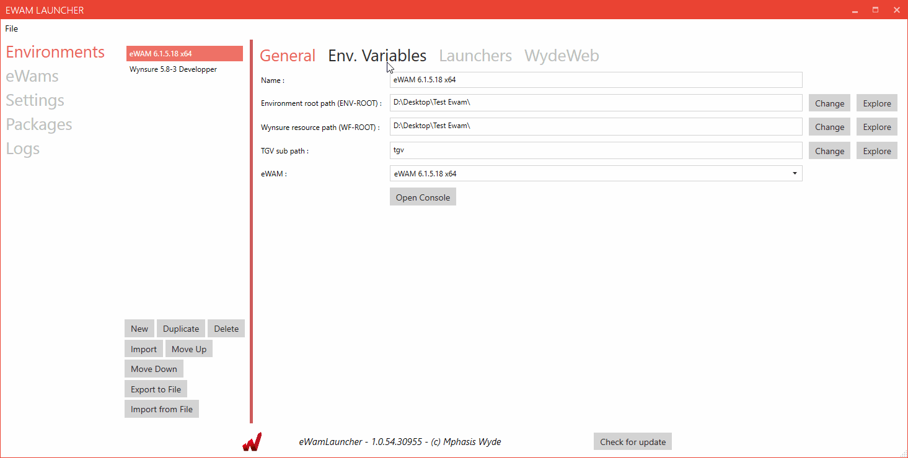
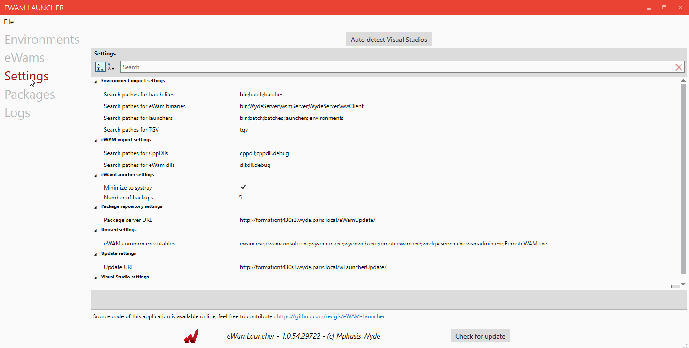
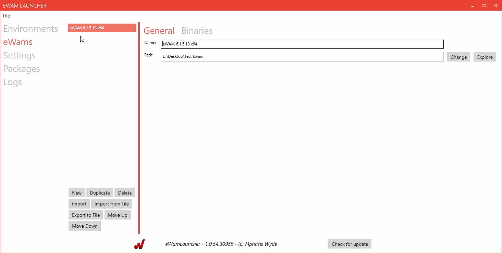
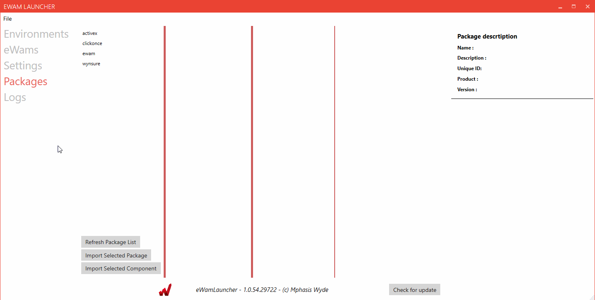
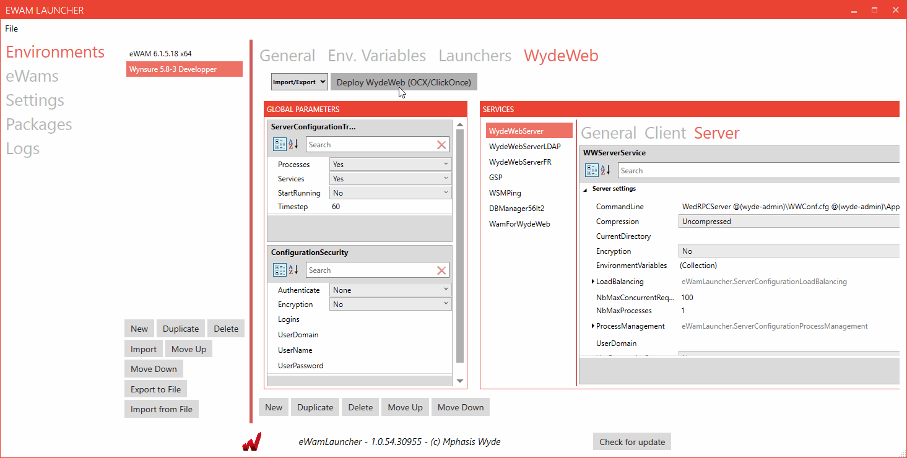
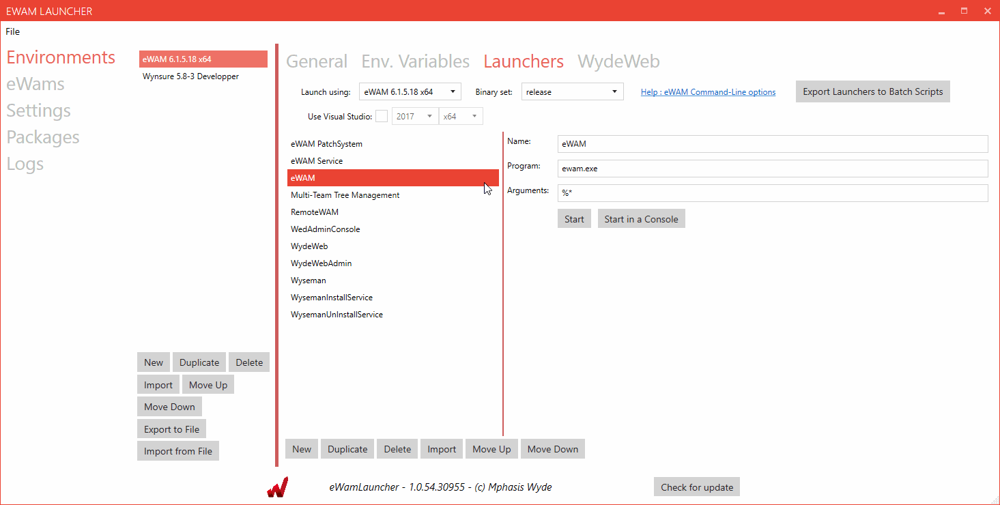
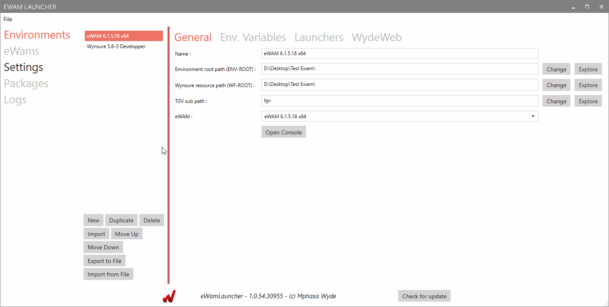

### Configure an environment

### Change Settings

### Application logs

### Import packages online

### Deploy WydeWeb

### Regenerate batch files for en environment

### Setup Visual Studio environment
