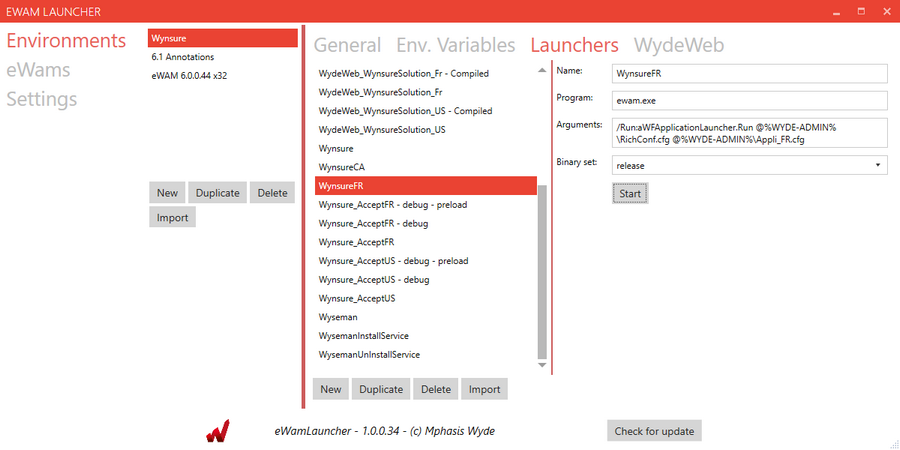
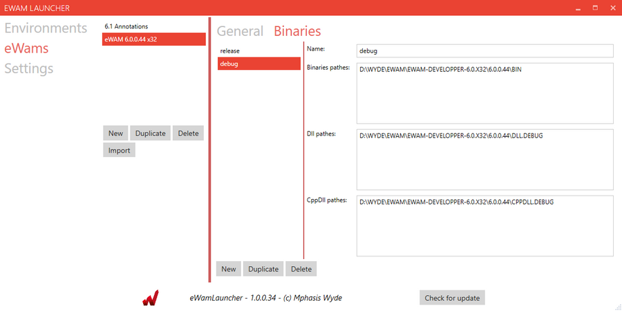
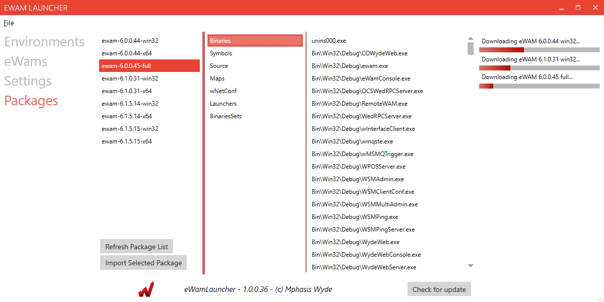

# eWam Launcher

This is a developper tool used to easily deploy and configure eWAM environments.

## Features

- Import existing local environment
- Create new environment from scratch
- Download pre-configured environment from onlin repository
- Launch eWAM custom commands
- Configure and export WydeWeb configuration files

Feature documentation : [Documentation](Documentation/features.md)

Current state of development : [Todo list](Documentation/todo.md)

