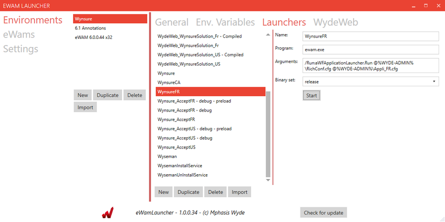
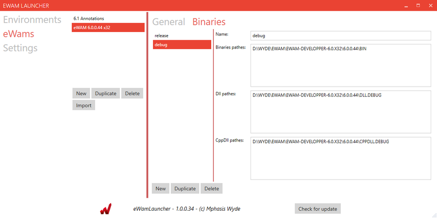
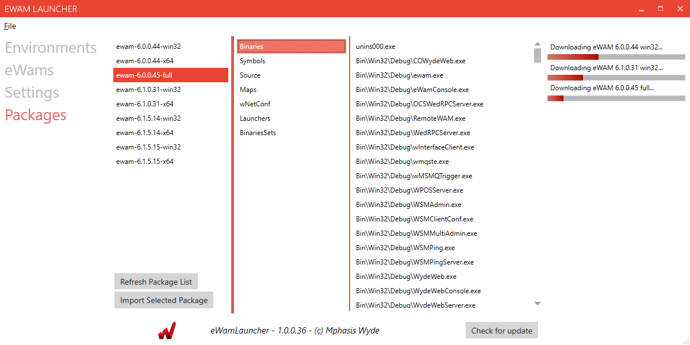

# Todo

## Basic features
- [ ] Implement WydeWeb configuration (Client configuration, server configuration)
- [ ] Allow to generate .bat files corresponding to launchers
- [x] Save / load session feature / button : implemented as a command (?)
- [x] Add menu bar, items, associated commands (?)
- [x] Command / Menu to export an entire environment or binary set
   
## Ergonomy
- [x] Shouldn't we simply have a pool of eWAMs referenced by the various environments ?
- [x] Remove Wyde-DLL : this should not be editable, and be set from the binaries set
- [x] Allow item reordering using buttons
- [x] When importing an eWAM, ask if wants to import the associated environment
- [x] When importing an environment, ask if wants to import the associated ewam if not already exists
- [ ] Impprovement : Allow item reordering by drag&drop in listboxes and datagrids : 
   https://stackoverflow.com/questions/3350187/wpf-c-rearrange-items-in-listbox-via-drag-and-drop
   http://www.hardcodet.net/2009/03/moving-data-grid-rows-using-drag-and-drop
   http://www.eidias.com/blog/2014/8/15/movable-rows-in-wpf-datagrid
- [ ] Add link to confluence commandline options in launchers page
- [ ] Don't die on any exception : have global try/catch for each feature (launch, import, explore, change path, etc). Show dialog box with exception message.

## Code quality
- [ ] Document code
- [ ] Replace / bind implemented "actions" to WPF commands
- [ ] XAML / WPF : How to create a UI for a specific type, and include it in another ? use pages ?
- [ ] Mutualize code between OnConsoleExecuteLauncher and OnExecuteLauncher
- [ ] Rewrite variable importing : sanitize wyde-root, env-root, wf-root, wyde-dll and path after importing, let user choose the right value from a list or set custom value
- [ ] Rewrite environment and ewam importing functions : buggy and messy at the moment

## Process management
- [ ] Process monitor looking up possible launchers working
- [ ] Retrieve launch status with standard output / error output
   => use WYDE-TGV env var to find matches
   
## Improve importing
- [x] Clean up environment variables at import : remove WYDE-DLL (which will be set at launch)
- [x] Should we discard WYDE-ROOT, and use ewam basePath ?
- [x] have a list of predefined subfolders in settings, to lookup into, for each type of thing to import
   e.g., for binaries : bin/, bin/win32/debug/, bin/win32/release, bin/release/op, etc... or just recursively lookup for binaries and dlls ?
- [ ] eWAM import : detect if 64 or 32 bits : https://superuser.com/questions/358434/how-to-check-if-a-binary-is-32-or-64-bit-on-windows
   https://stackoverflow.com/questions/1001404/check-if-unmanaged-dll-is-32-bit-or-64-bit
- [x] eWAM import : remove eWAM root prefix from binaries pathes : only keep the sub-folders path. e.g. CppDll\Win32\Debug
   
## General settings
- [x] Implement application settings class, make it serializable
- [x] have a list of folder in which to lookup when importing a new environment
- [x] reload last session (based on last session file opened, default is in %appdata%)
- [x] address of update server
- [ ] Add "Additional pathes", and forbid "PATH" in environment variables

## Binaries/environment deployment from Web repository
- [x] Have a repository index online with all eWAM binaries
- [x] Add a progress bar for each package pull started
- [ ] Allow comparing local environment and suggest update binaries
- [ ] Use nuget packaging ?
      
## Auto update
- [x] Auto updater using Squirrel

## Visual Studio environment
- [ ] Add Section with VS2010, VS2012 path to be called if needed ?

## Environment from scratch
- [x] Allow download of entire environment binaries, from scratch
- [x] Set of basic launchers for eWam (wEwam class in embeded xml file resource, ready to be deserialized into a new object)

## Bugs
- [x] eWAM import not importing its own environment correctly
- [x] Launcher Delete button not setting selection correctly after deleting last element of the list
- [x] Environment import creates an additional new environment for the eWAM set, even if the eWAM already existed
- [x] Wynsure launcher doesn't work when using environment variables in cmmand line parameter (e.g. @%WYDE-ADMIN%\config.cfg)
- [x] Block adding WYDE-ROOT : set at launch to binary root path
- [x] When importing an eWAM, the associated environment, the binary set isn't set in environment
- [x] When changing eWAM, also change (or at least remove) all the binary set used in the launchers
- [x] Add path to Wyseman and WydeWeb.exe somewhere (at import of eWAM or environment, or in path, at launch)

https://youtu.be/rDjrOaoHz9s

- idea : VSCode plugin could use eWAM Launcher environments to choose on which env one is working
- IIS: remove all URL filterings and Hidden Segments. Add .* MIME type as application/octet-stream
- XML => xsd => .cs  : https://stackoverflow.com/questions/3187444/convert-xml-string-to-object